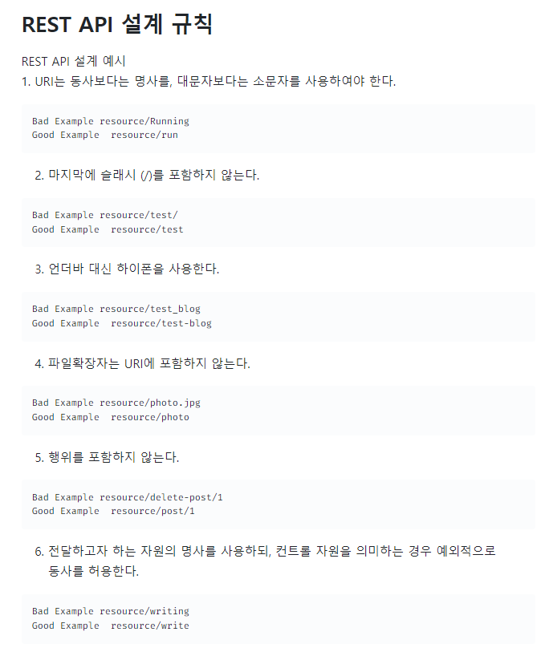

[22.07.21 회의록]

# 오늘 할일

* 백엔드 
  * api설계 끝나면 바로 개발

* 프론트엔드
  * 스켈레톤 코드 작성
  * 컴포넌트 구조 짜기
  * css 설계
  * 라우터주소 정하기

## 백엔드

1. api설계 끝나면 바로 개발

   restapi 규칙

   

2. 포스트맨 api 명세서

   [api 명세서](https://documenter.getpostman.com/view/20351344/UzQvsQSH)

   

## 프론트엔드

1. 스켈레톤 코드 작성

2. 컴포넌트 구조 짜기 & 라우터주소 정하기

3. css 설계

* 테마색과 온식고 메뉴 이름 정해야함 
* 뒤로가기는 모두 삭제 
* 아이콘은 어떤 아이콘을 쓸까?
  * 폰트어썸 - 선만 그러져있는 아이콘 사용하여  색은 css로 바꿀 것
  * 아이콘 선 굵기는 레귤러
  * 이해하기 어려운 아이콘일거 같은 경우 회의를 통해 글자 버튼으로 변경

* 글자체: 중요성 정리해서  * extra bold * bold * regular
* 메인페이지
  * In toggle 토글 바에 메뉴 이름은 검정색으로
  * 웹에서는 호버 상태에 초록색(우리 메인색)
  * 모바일에는 호버 없이 검정
* 메뉴 이름 변경
  * 마이페이지 -> 내정보
  * 전체상품 -> 전체상품조회

* 알림페이지
  * 보더 1px solid black; color : none; 

* 버튼
  * 활성화
    * 테마 컬러색으로 채우기
    * 글자색은 흰색 
  * 비활성화
    * 컬러 = b9b9b9;
    * 글자색 흰색 
    * 시간 글자색 : c9c7c7;
* 알림페이지 (상세)
  * 버튼
    * 활성화시 그대로
    * 비활성화시 테마색의 보색으로
* 네비게이션(ex-주문하기, 알림페이지 등과 같이 현재 위치 알려주는 것) 
  * 글자체 : extra bold 
* 컨텐츠 제목바 
  * 글자체 : bold 
  * 나머지 regular 
* 주문거절페이지 
  * 사유버튼 
  * 기본상태
    * 버튼색과 글자색은 하면서 결정

* 알림
  * 글을 쓸경우 네모 박스를 만들어서 내용을 넣을 것

* 모달 관련
  * 안좋은 쪽은 테마 보색으로 보여준다.
  * 나가기 버튼을 X 버튼으로 만들기
