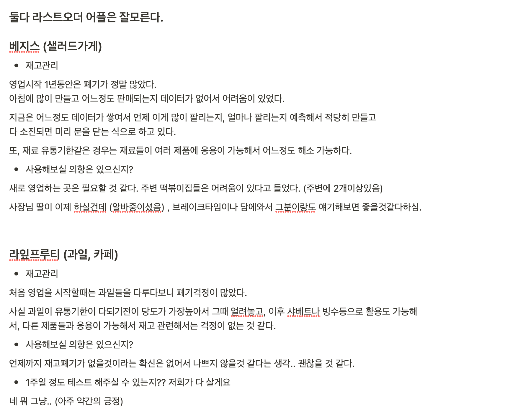

[22.07.14 회의록]


새로운 주제 두둥 등장!


# 미정이2

## 프로젝트 개요

- **주제 : 부산 당일 폐기 음식 공유 사이트**
- 기간 : 2022-07-05 (화) ~ 08-19 (금)
- 발표 : 2022-08-19 (금) 예정


### 프로젝트 컨셉 : ***\*부산 당일 폐기 음식 공유 사이트\****

- **주제 선정 이유 & 주 고객층**

  ```
  소비자를 못 만나고 폐기되는 음식이 국내에서만 연간 13조원어치
  사회적으로 음식물 쓰레기를 줄일 수 있다.
  - 고객들은 싼 값에 음식을 구매 할 수 있다.
  - 점주들은 신규 고객을 얻을 수 있고, 폐기 음식 처리 비용 또한 줄일 수 있다.
  - 동네 경제 활성화
  
  범위: 반찬가게, 샐러드가게, 시장 등 동네 오프라인 음식점 대상
  음식 범위: 당일날 판매되지 못하면 폐기되는 음식
  미리 명지, 신호동 위주 가게 사장님과 시장조사 할 예정
  
  대상(타겟):
   - 재고관리가 힘든 가게
   - 창업한지 1년이내 인 가게
   - 재래시장 -> 홍보효과
  ```

- **주요 기능**

  ```
  - 처음 제품 사진, 제품명, 가격, 카테고리 등을 선정하고 제품 등록할 수 있게
    - 이 방법이 번거로울 경우 저희기 미리 다 넣을 생각입니다
    - 계약 시, 전 제품의 데이터를 받아서 상품명, 가격, 카테고리, 상품 사진 등을 입력시킴
  
  - 기록을 남겨서 재등록시 입력 시간을 아낄 수 있게 만든다.
     
  - 폐기음식 공유 기간은 디폴트는 하루인데 2~3일 정도 선택이 가능하게 한다
  
  - 선 결제 시스템 ( 배달 X , 픽업) 
    - 노쇼 문제 발생
    - 취소, 환불 가능하지만 10, 20분 전에는 교환 / 환불이 불가능하게끔 (사장님의 확인 버튼이 있을시에는 예외)
  
  - 가게 등록할 때 매장명, 매장 주소, 번호 입력시 등록
    - 매장명과 주소 전화번호 확인 후 등록완료
  
  - 선결제를 한다는 조건 하에 
    카카오톡 채널을 이용하여 웹으로 알림이 가는 것이 아닌 카카오톡을 통해 알림이 가게끔
    - 점주는 해당 재고가 선결제가 완료되면 재고 빼낼 수 있게 카카오톡 알림
    - 고객은 즐겨찾기를 해놓은 상점이 상품을 등록하면 알림이 가게 혹은 픽업이 가능하게 
      준비가 다 되었다면 알림이 가게끔
      -> 사업자 등록이 되어있어야 알림기능이 가능하다, 확인요망
  
  - 지도 API를 이용하여 현재 위치 주변 음식점을 보여주기 
  
  - 선결제를 하지 않더라도 소비자가 구매할 거라는 의사표시를 할 수 있게 
    - 단점: 노쇼
    - 노쇼를 여러 번 할 경우 패널티
  ```

  

- 유통기한은 지났지만 소비기간이 남은 경우 기부가 가능하게
  - 사회공헌적으로 점주들의 기부
  - 하루에 버려지는 음식물의 양 UCC
  - 데이터를 보여줌으로써 재고 조절을 할 수 있게 만든다.

- 참고 사이트
  - 라스트오더
    - 차별점
      - 프랜차이즈가 아닌 로컬 음식점 중심
      - 라스트오더는 완제품(만들어진 음식, 혹은 편의점 음식 등)만 판매중
      - 우리는 완제품이 아닌 육류, 야채 등 식자재도 포함

* 시장조사

  


## 주요안건

1. 팀미팅의 주요안건
   - 이 주제로 밀고가도 될 것인가?
   - 어떤 부분이 추가 보완 되면 좋은지
   
2. 피드백 받고 싶은 주요 내용

   - 전통시장을 타겟을 잡고싶음

     ```
     타 어플과의 차별점을 두기 위함
     동네 경제 활성화라는 공공성을 확대하기 위함
     시장 협회가 이러한 홍보효과에 우호적임
     UI가 복잡해서 아직까지 타 어플이 해결하지 못함
     상인분들의 연령대가 높아서 단순한 UI로 만들어야함
     ```

     - 기성세대 사용을 이끌어내는 방법이 어떻게 해야 할지
     - 단순한 UI를 만든다고해서 이끌 수 있을까

   - 서브기능으로 결제시스템
     
     ```
     결제를 하게 할지 OR 결제 서비스를 하지 않고 직접 픽업하게 할지
     
     - 선결제를 하게 하자!
       - 장점
         - 노쇼 방지 예방
         - 재고를 자동적으로 반영 가능
       - 단점
         - 타 서비스에 집중 못함
         
     - 결제 서비스를 하지 않고 직접 픽업하게 하자!(재고만 공유)
       - 장점
         - 통계 서비스 등 타 서비스에 더 집중할 수 있음
         - 기부 쪽에 집중 -> 공공성 확보
       - 단점
       	- 재고가 실시간 업데이트가 안됨
       	- 노쇼,,
     ```
     
     
     
     - 고객과 점주간의 직통으로 거래를 만들수 있는지


## 피드백

* 시장 조사 사진 첨부해서 발표

* 테스트 기간을 1주일 이상 + 피드백을 받은 것을 수정 하는 것 1주일 잡아서 최소 3주 안에 개발 마무리 !

* 사회 공공성을 위해서는 음식 기부 사이트 연결

  * 업주들 탭에 기부를 하는 사이트로 연결(점주들만 가능) - 좋은 마음 가짐으로 

  * 가공식품과 장류, 식용류, 음료류의 경우 최소 30일 이전, 신선식품의 경우 최소 7일 이전, 제빵류는 최소 3일 이전까지 기부가 가능하다.

    * 찬성 [기사](https://www.ajunews.com/view/20151211142458206)

    * 반대 [기사](https://jeju.noriter.net/4)


  * `만약 기부를 많이 한다면(금액) 상단 배너에 무료로 상점 노출`
  * 기부 영수증을 제출한 후 관리자가 확인하고 상점 선정
  * [푸드뱅크](https://www.foodbank1377.org/donate/guide.do)

* 구글 설문으로 해서 소비자의 시장도 조사하기!

* 어떤 상품이 언제 재고가 가장 많이 남는지에 대한 통계 조사해서 점주들에게 보여주기


## 기능

* Account
  * 로그인
    * 소셜 로그인(네이버, 카카오 등)

  * 로그아웃
  * 회원가입
    * 회원가입 할 때 점주와 고객을 구분해서 받음(차별적인 회원가입)
  * 회원탈퇴
  * 마이페이지(점주)
    * 가게정보 등록은 관리자가 하는 걸로
    * 수정은 점주 본인이(주소, 연락처 등 - 인증)

  * 마이페이지(고객)
    * 단골집 등록
    * 주소 등록

* Product
  * 전제품 CRUD(by 관리자)
    * 점주가 자체적으로 제품을 등록할 수 있는 기능(신제품인경우)

  * 지도(현위치 or 원하는 위치 설정 가능)

* Notice
* Donation

* [main]page
  * 우리의 프로젝트 의의 목표
  * 기부 많이 한사람들 광고 or 상점의 광고
* [navigation]page
  * 탭
    * 점주: 로고, 할인상품, 본인 매장의 전상품, 기부하기, 로그인, 회원가입/ 로그아웃, 회원탈퇴
    * 고객: 로고, 할인상품, 로그인, 회원가입/ 로그아웃, 회원탈퇴


## 특이사항

- 점주와 고객이 보는 화면이 아예 다름
- 점주가 고객을 하려면 따로 가입을 해야함

* 인증은 수동으로 전환 (사업자 신청 - 사업자등록번호, 주소, 전화번호 등을 받음) -> 관리자가 확인
  * 사업자 등록번호 진위 확인 api 사용 [사업자 진위확인](https://www.data.go.kr/bbs/ntc/selectNotice.do?pageIndex=1&originId=NOTICE_0000000002110)

## 내일 할 일

- 프로젝트명 정하기(오전)
- 세부 기능 정하기(오전)
- 주말까지(시작은 내일 오후부터)
  - 백엔드: ERD 완성
  - 프론트엔드: 피그마 생성
- 결제 시스템 할지 안할지 결정 - 안하기로 결정!

