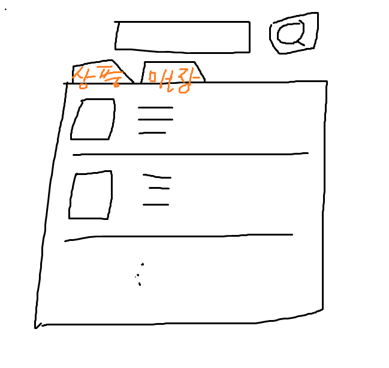

[22.07.15 회의록]


## 오늘 할일

- 프로젝트명 정하기(오전)
- 세부 기능 정하기(오전)
- 기능별
  - 백엔드: ERD 만들기 시작
  - 프론트엔드: 피그마 만들기 시작
- api 연결


## 지라랑 깃 사용

본인의 역할을 이슈로 올리고 

다 하면 완료 버튼을 누름!(by 각 프론트엔드, 백엔드 팀장한테 완료 버튼 클릭 받기)


## 프로젝트명 정하기

최후의 만찬

스톡매니저 Stock Manager

스트롤 (Strol - Stock conTROL, 재고 컨트롤)

스토일 (Stoil - STOck saIL 재고를 판다)

라셀 (Lasell - LAst SELL ,마지막으로 판다)

리듀스 (Reduce - 재고를 줄이자는 뜻으로)

룩마톡 (Lokmatock - Look my Stock , 내 재고를 봐라?)

지구 (지구를 구한다)

레프트랩(남은left + 포장wrap)

오늘의 퇴근

마감세일

saleing + sailing : 우리는 지구를 지킬때까지 끝까지 항해한다..!

사줘

온 식 고 (On Sik Go): 따뜻한 마음(온)을 식품에 담아 팔고 사고 , 온 지역에 ( 목표(?)) , 온 세계로 ( 꿈(?))

스테아리엔 Stearien  : Stock + Clear + vien (만족스러운 재고 클리어)


결론: 온식고


```
1. 따뜻한 마음을 식품에 담아 팔고 사고
2. 온 지역으로 식품을 팔러 간다
3. 온 세계로 식품을 팔러간다
```


## 상세 기능 정하기

* 메인 페이지

  * 사용자의 navbar에는 + 커뮤니티(자유게시판-서브기능)
    * 고객, 점주 모두 사용 가능

  * 가입 안한 사용자는 댓글 , 좋아요, 팔로잉 아예 사용 x
    * 가입 안한 사용자는 리스트만 보고 상세 정보 보기는 못 봄

  * 회원 탈퇴 숨김 - 마이페이지 설정안으로 숨김

* 할인상품

  * 음식 리스트에서 나의 현재 위치로부터 얼마나 떨어졋는지 보여주기

  * 검색기능: '햄버거' '냉면' 음식 이름 카테고리 이름 + 음식점 이름 검색가능 

    * 셀렉트 박스를 둬서 음식이름인지 음식점 이름인지 선택할 수 있게!

      => 음식, 음식점 탭으로 따로 보여줌

      

    * 음식이름을 검색할 경우

      * 음식 - 리스트로 수루룩 보임

    * 음식점 이름을 검색할 경우

      * 음식 가게 - 들어가야 상품이 보여짐

    * 내 위치 주변 내에 있는 음식의 리스트를 보여주기

    * 음식 이름을 검색하면 햄버거에 해당하는 리스트를 지도 + 리스트로 보여주기

    * 검색 알고리즘 

      * 함버거 -> 햄버거
      * **의문점(?)**
        * 맞춤법 api (- 로버트가 찾아보는걸로)
        * LCS 알고리즘
        * 코사인 유사도
          * 오타를 쳤을때 
          * 검색엔진을 가장 많이 사용, 오타 사전 따로 운영

  * 기부배지 받으면 리스트에서 먼저 보여주는걸로 

  * 리스트에서 할인가격만 보여주는게 아니라 정가 + 할인가격 다 보여주기

  * 탭으로 지도와 카테고리 설정 가능!

    * 배민에 있는 카테고리 있으면 좋겟다
    * 비슷한 서비스 참조
    * 

* 상세페이지
  * 상세위치가 필요함 - 지도로 보여주기
  * 상세 위치 전에 도보 몇분인지 보여주기
    * 나의 현재 위치로부터 얼마나 떨어졋는지 보여주기
  * **장바구니 이슈,, (의문점)** - 추가 기능
    * 다른 상점일 경우 꼬일것 같다 - 메시지를 보내기 '상점이 다릅니다'
    * 유저가 봤을 때 헷갈릴것같다
    * 상품 게시기간이 하루를 지났을 경우 장바구니에 그대로 남아놓을지 아니면 비어놓을지
      * 쿠키로 하면 문제가 없음
  
* 본인 매장의 전상품
  * 재고를 눌렀을 때 나오는 모달폼에 할인가를 입력하는 input 추가
  * 그 밑에 자동적으로 계산해서 '~%할인율이다'라고 보여주자!
  
* 알림
  * 거절 누를 때 재고부족, ... 등 셀렉트 박스를 눌러서 거절 사유에 같이 첨부해서 사용자에게 알림을 보낼 수 있도록
  * 단골 매장 확인하러가기를 클릭하면 상점의 마이페이지로 이동 -> 오늘 할인 상품 리스트 보여주기 
  
* 로그인
  * 소셜 로그인(네이버 , 카카오)
  * 사업자 등록번호 진위 확인 api 사용 [사업자 진위확인]
  
* 마이 페이지
  * 매장 정보 폐기는 이대로 -but alert
  * 수정도 이대로 

* 통계페이지 
  * 점주들만 보여줌 - 마이페이지 안에서 데이터 분석 버튼을 따로 만들고
  * 클릭하면 모달이나 페이지를 보여줌
  * 점주들 입장에서 얼마나 폐기가 되었는지 확인!
  * '제일 많이 남은 재고의 제품명은 -- 였어요!'
  * 선 그래프 - 상위 다섯개만 날짜마다 팔린 재고, 남는 재고 보여주기
  * 우리 어플을 통해, 오늘은  '이 어플을 통해서 얻은 가격' 만큼 세상을 구하셨어요!! 


## 특이사항

- 점주와 고객이 보는 화면이 아예 다름
- 점주가 고객을 하려면 따로 가입을 해야함

* 인증은 수동으로 전환 (사업자 신청 - 사업자등록번호, 주소, 전화번호 등을 받음) -> 관리자가 확인
  * 사업자 등록번호 진위 확인 api 사용 [사업자 진위확인]

* 완성형의 디자인 -> 피그마로 사용 (주말에,,) - 프로토타입 타입 제작
* 설문조사!

* figma에 익숙해지면 css style도 추출해서 개발에 사용할 수 있어요